<p align="center">
  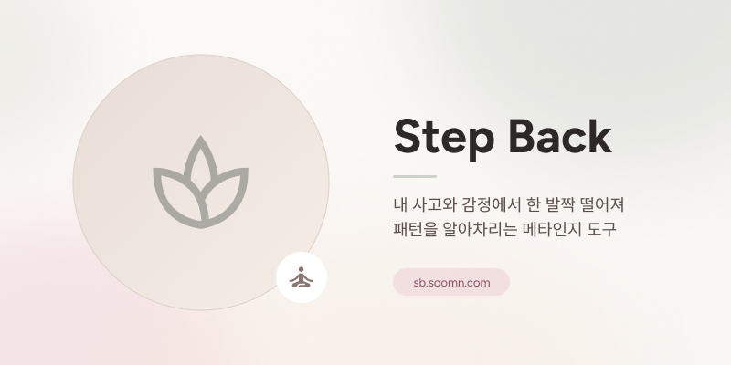
</p>

<p align="center">
  <sub>한 발짝 물러서, 내 마음을 본다 — 사고와 감정의 패턴을 알아차리는 메타인지 도구</sub>
</p>

<p align="center">
  <a href="https://sb.soomn.com"></a>
  &nbsp;
  
  &nbsp;
  
</p>

<p align="center">
  🚀 <a href="https://sb.soomn.com">Live Demo</a> &nbsp;|&nbsp;
  📝 <a href="https://app.notion.com/p/GDG-5-5-Team-1-5e2560204dbc82668fb581d70f657e39?source=copy_link">팀 노션</a> &nbsp;|&nbsp;
  🎨 <a href="https://www.figma.com/design/tkkkJjkuf569wvJCFHwmgu/Design?node-id=0-1&t=3bIgz8MbDDR42QX5-1">Figma</a>
  <br/>
  💻 <a href="https://github.com/GDG-on-Campus-KNU/0-to-product-team-1-fe">Frontend Repo</a> &nbsp;|&nbsp;
  🗄 <a href="https://github.com/GDG-on-Campus-KNU/0-to-product-team-1-be">Backend Repo</a> &nbsp;|&nbsp;
  🤖 <a href="https://github.com/ksjerev17/stepback-ML-GDG-team1-ml-/tree/8f1d80b85f100fd55689f7dcea1746b64f811352">ML Repo</a> &nbsp;|&nbsp;
</p>

---

## 📖 프로젝트 소개 (Introduction)

> **"자기계발서를 다 읽을 시간은 없습니다. 그래서 '행동'으로 자기를 발견합니다."**

**Step Back(스텝백)** 은 바쁜 일상 속에서 **하루 한 줄**을 적으면, 그 글에 담긴 사고·감정 패턴을 분석해 **3분짜리 마음 행동(드릴)** 한 가지를 추천하는 **인지·행동 기반 메타인지 도구**입니다.

이론을 먼저 배우고 나에게 적용하는 *연역적* 방식이 아니라, 작은 행동을 먼저 받아 시행착오로 나를 알아가는 **귀납적(inductive)** 방식을 택했습니다. 기록이 쌓일수록 추천은 점점 더 나에게 맞춰지고, 주간·월간 리포트로 마음의 변화를 데이터로 돌아볼 수 있습니다.

- **개발 기간:** 2026.04.30 ~ 2026.06.25
- **배포 주소:** **https://sb.soomn.com**

<br/>

### 🌿 우리가 만드는 것 — "진단이 아닌, 발견 도구"

Step Back은 정신건강 **진단 앱이 아닙니다.** 이 차별성은 *무엇을 하는가*가 아니라 **무엇을 하지 않는가**에서 나옵니다.

| 진단 앱이 하는 것 | Step Back이 하는 것 |
| :--- | :--- |
| "당신은 우울증 위험군입니다" 라벨 부여 | "오늘 글에서 '망할 것 같아'가 보이네요" 처럼 **단서 제시** |
| PHQ-9 · GAD-7 등 표준 설문 점수화 | 진단명 X — 인지 6 · 행동 2 · 감정 5 **신호로 분류** |
| 약물 · 전문 상담 권유 | 지금 상황에 맞는 **3분 행동(드릴) 1개** 추천 |
| 의료기기 인증 · 법적 책임 동반 | "우울증" · "치료" 같은 단어는 **코드에서 자동 차단** |
| 사용 자체가 "환자가 되는 경험" | 사용 자체가 **"자기를 알아가는 시간"** |

<br/>

## 📌 목차

- [프로젝트 소개](#-프로젝트-소개-introduction)
- [핵심 기능](#-핵심-기능-key-features)
- [동작 원리](#-동작-원리-how-it-works)
- [안전 설계](#-안전-설계-safety)
- [학술 근거](#-학술-근거-academic-foundation)
- [시스템 아키텍처](#-시스템-아키텍처-architecture)
- [기술 스택](#-기술-스택-tech-stack)
- [기술적 도전](#-기술적-도전-technical-challenges)
- [실행 방법](#-실행-방법-getting-started)
- [프로젝트 구조](#-프로젝트-구조-project-structure)
- [팀 소개](#-팀-소개-team)
- [면책 조항](#-면책-조항-disclaimer)

<br/>

## ✨ 핵심 기능 (Key Features)

Step Back의 하루는 **기록 → 분석 → 드릴 → 돌아보기**로 이어집니다.

<br/>

### 📝 1분 기록 — 한 줄과 4종 슬라이더

> 오늘 신경 쓰였던 일을 한 줄로 적고, **컨디션 · 수면 · 운동 · 사교 활동**을 슬라이더로 남깁니다. 글에서 드러나지 않는 몸 상태까지 함께 기록해, 분석의 입력 신호로 사용합니다.

<table>
  <tr align="center">
    <td><strong>하루 1분, 한 줄 + 상태 입력</strong></td>
  </tr>
  <tr align="center">
    <td>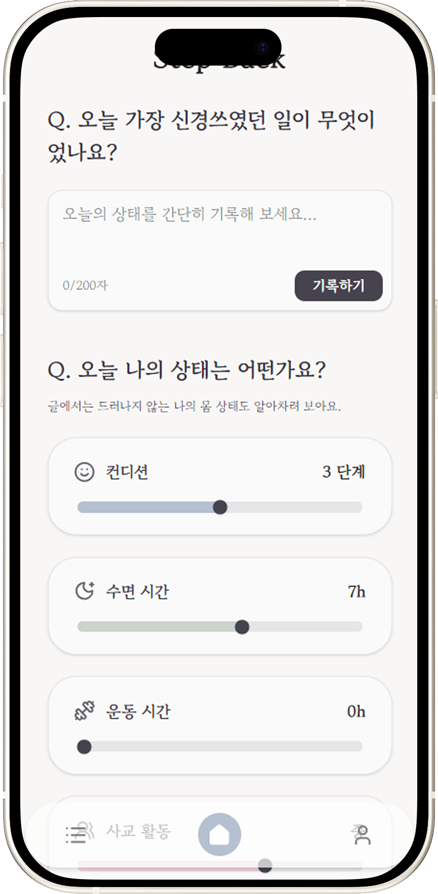</td>
  </tr>
</table>

<br/>

### 🎯 AI 분석 & 오늘의 마음 드릴

> 입력한 글은 **13차원 점수**(인지·행동·감정 신호)로 분석되고, 결과에 맞는 **마음 드릴 1개**가 추천됩니다. 화면에는 추천된 드릴과 함께 오늘의 **사고 패턴 · 감정**이 같이 보여, 내가 직접 단서를 확인할 수 있습니다. 드릴을 실천한 뒤엔 **"도움돼요 / 도움안돼요"** 로 평가해 다음 추천을 교정합니다.

<table>
  <tr align="center">
    <td><strong>오늘의 마음 드릴 + 사고 패턴/감정</strong></td>
    <td><strong>상태 요약 + 드릴 평가</strong></td>
  </tr>
  <tr align="center">
    <td>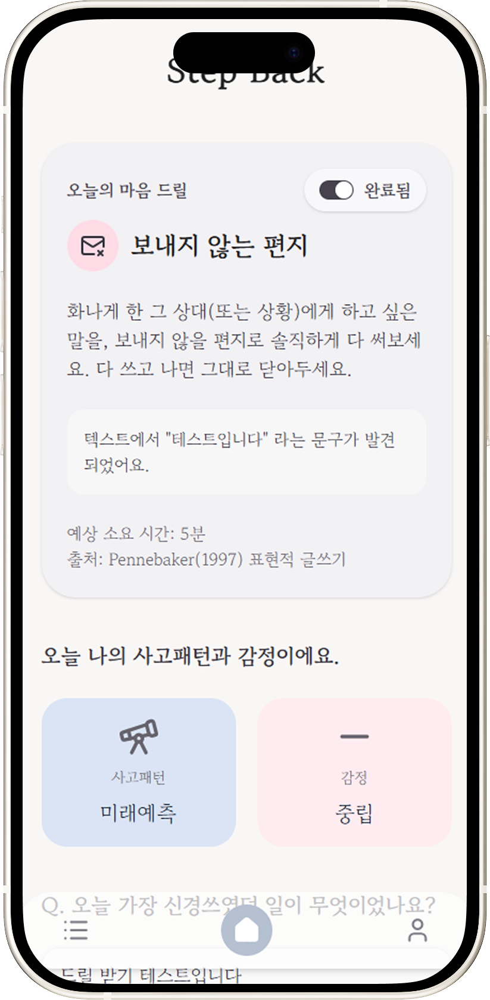</td>
    <td>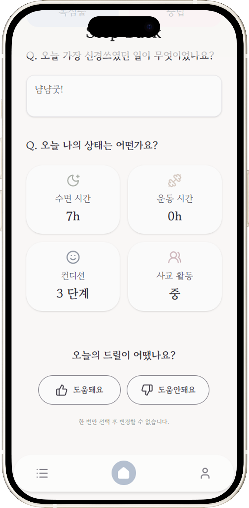</td>
  </tr>
</table>

> **7가지 마음 드릴 유형** — 생각 전환 · 행동 시작 · 자기자비 · 감정 인식 · 수면·회복 · 호흡·신체 · 관계 돌봄

<br/>

### 📅 캘린더 — 한 달의 마음 여정

> 한 달의 기록을 한눈에 봅니다. **드릴 종류별 컬러**와 **카테고리 아이콘**으로 직관적으로 구분되고, 완료 여부에 따라 투명도를 다르게 적용해 진행 상태를 표현합니다. 날짜를 선택하면 그날의 사고 패턴 · 감정 · 컨디션을 확인할 수 있습니다.

<table>
  <tr align="center">
    <td><strong>월간 캘린더로 보는 마음의 흐름</strong></td>
  </tr>
  <tr align="center">
    <td>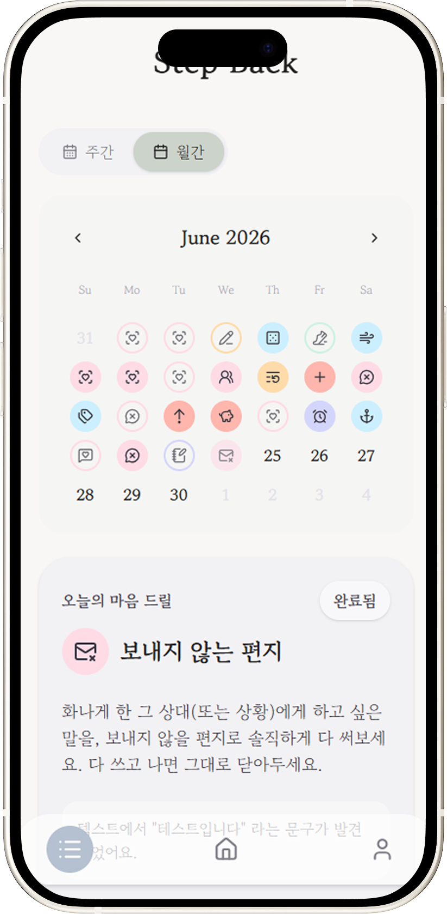</td>
  </tr>
</table>

<br/>

### 📊 주간 · 월간 리포트 — 데이터로 돌아보는 나

> 일주일의 기록으로 나를 이해하는 지도를 만듭니다. **주간 감정 분포(5각형 레이더)**, **컨디션 흐름 추이**, **생활 지표 요약**, 그리고 지난주 대비 **패턴 변화**까지 한 화면에서 확인합니다. 마지막엔 **'나의 발견'** 에 내가 스스로 알아챈 인사이트를 직접 기록합니다.

<table>
  <tr align="center">
    <td><strong>주간 기록 목록</strong></td>
    <td><strong>일일 드릴 기록</strong></td>
    <td><strong>주간 감정 분포</strong></td>
  </tr>
  <tr align="center">
    <td>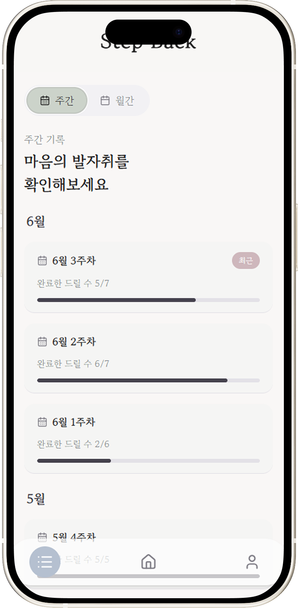</td>
    <td>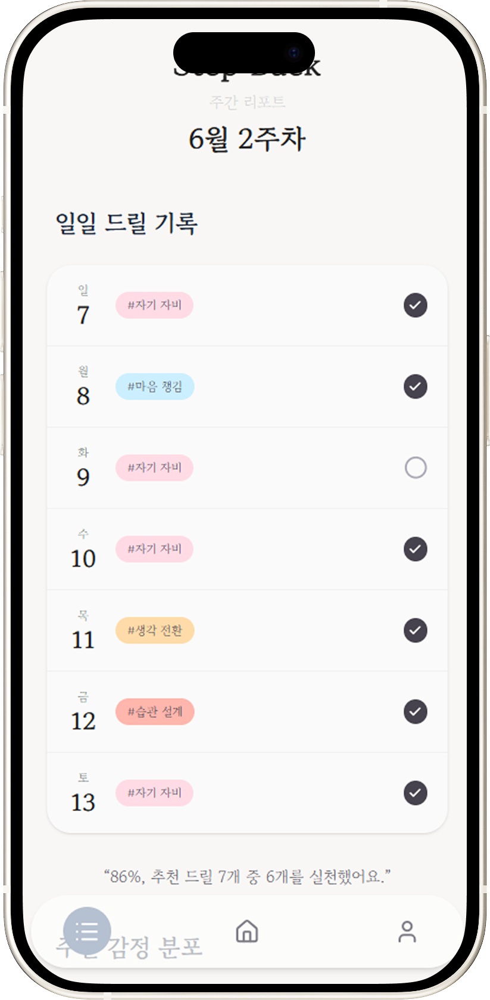</td>
    <td>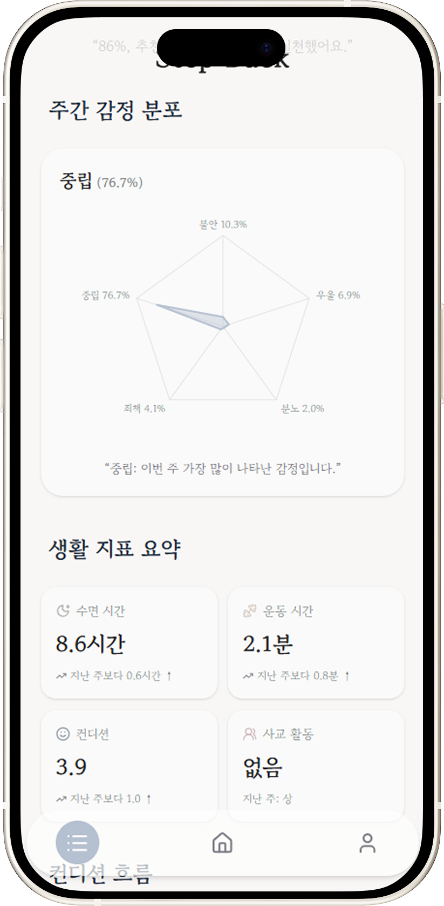</td>
  </tr>
  <tr align="center">
    <td><strong>컨디션 흐름 & 패턴 변화</strong></td>
    <td><strong>나의 발견 기록</strong></td>
    <td><strong>주간 회고 퀴즈</strong></td>
  </tr>
  <tr align="center">
    <td>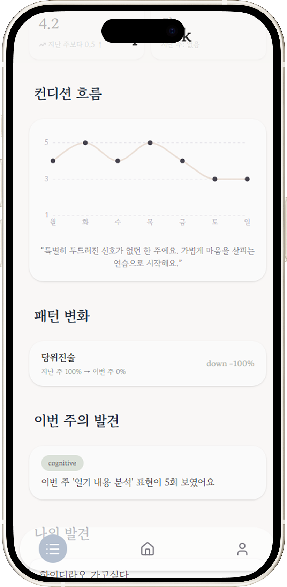</td>
    <td>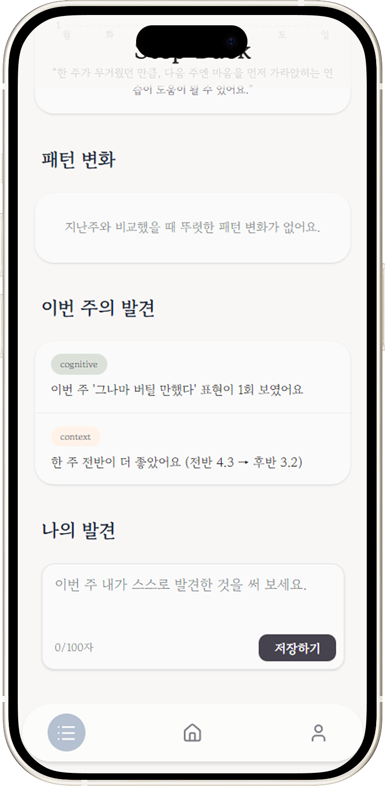</td>
    <td>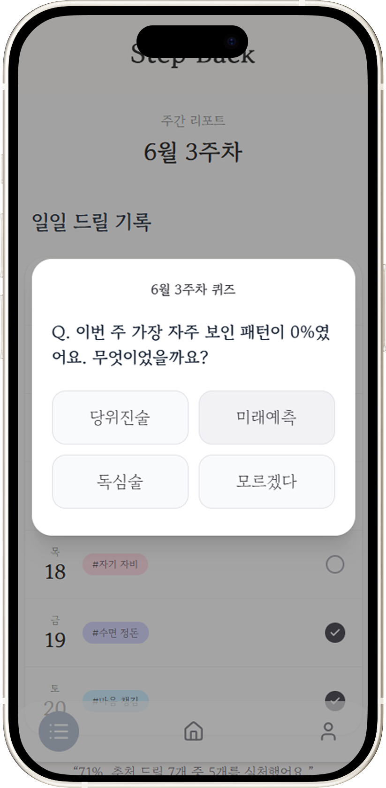</td>
  </tr>
</table>

<br/>

### 🆘 위기 신호 보호

> 위기 신호가 감지되면 일반 드릴 대신, **전문 상담 창구**(자살예방상담 1393 · 청소년상담 1388 · 정신건강위기상담 1577-0199)를 즉시 안내합니다. 이때 사용자의 글은 외부 AI 서버로 전송되지 않습니다.

<table>
  <tr align="center">
    <td><strong>혼자 견디지 않도록 — 즉시 상담 연결</strong></td>
  </tr>
  <tr align="center">
    <td>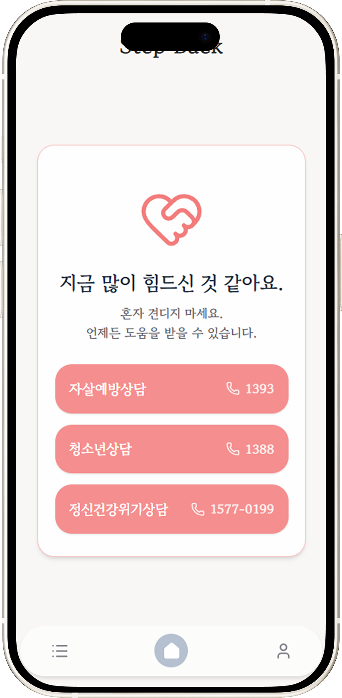</td>
  </tr>
</table>

<br/>

## 🧠 동작 원리 (How It Works)

### 점수는 어떻게 나오나

가게 점원이 손님의 기분을 0~1 사이로 적어주는 셈입니다. 단, **손님의 이름·연락처는 절대 못 보게 가린 채로** 묻습니다.

```
한 줄 입력 ─▶ 개인정보 마스킹 ─▶ LLM(Gemini) ─▶ 환각 가드 ─▶ 최종 점수
 사용자 텍스트   이름·전화 등 치환    13차원 0~1 점수   과신 잘라냄    검증 가능한 점수표
```

> **예시** — 입력: `"내일 발표 망할 것 같아"`
> → 미래예측 `0.7` · 자기비난 `0.1` · 불안 `0.6` · 중립 `0.3` · confidence `0.55`
> → 시스템은 *"인지 패턴 중 '미래예측' 신호가 가장 강하다"* 고 알아챕니다.

<br/>

### 드릴은 어떻게 추천되나 — "5장으로 된 결정 트리"

AI 블랙박스가 아니라, **모든 분기에 명시적 규칙**이 있어 *왜 이 드릴이 나왔는지* 추적할 수 있습니다.

| 단계 | 조건 | 응답 |
| :--- | :--- | :--- |
| **1단계** | 위기 신호가 보이면 | 즉시 상담(1393) 안내, 일반 드릴 X |
| **2단계** | "망할 것 같아" 같은 인지 패턴이 강하면 | 생각을 다르게 보는 드릴 |
| **3단계** | "미루게 돼" 같은 회피 신호가 강하면 | 작은 행동으로 시작하는 드릴 |
| **4단계** | "의미 없어" 같은 무기력 신호가 강하면 | 습관 설계 드릴 |
| **4.7단계** | 감정만 강하고 인지 패턴은 약하면 | 감각 환기(그라운딩) 드릴 |
| **5단계** | 신호가 모두 약하면 | *"오늘 평온한 하루였네요"* |

<br/>

### 왜 그냥 ChatGPT가 아니라 Step Back인가

> 핵심은 — **LLM 출력을 사용자에게 직접 보여주지 않는다**는 것입니다. LLM은 엔진 중 하나일 뿐, 사용자에게 말하는 화자는 *결정적 함수*입니다.

| 항목 | LLM에 직접 질문 | Step Back |
| :--- | :--- | :--- |
| 같은 입력의 응답 | 매번 미세하게 다름 | **항상 같음** (temperature 0.1 + JSON 모드) |
| 판단 근거 | "종합적으로 그렇습니다" 류 | **evidence_span** — 텍스트 내 단서 인용 |
| 누적 분석 | 매 세션 독립, 비교 불가 | **주간 7일 · 월간 30일 통계 + 자동 발견** |
| 위기 신호 보호 | 지연 후 일반 응답 시도 | **LLM 호출 전 차단, 평문 외부 전송 0건** |

<br/>

## 🛡 안전 설계 (Safety)

정신건강 데이터는 다른 어떤 데이터보다 무겁습니다. Step Back은 **4중 방어**로 사용자를 보호합니다.

| # | 방어 | 동작 |
| :-: | :--- | :--- |
| **01** | 위기 신호 사전 차단 | "죽고 싶" 류 표현 시 **LLM 호출 자체를 안 함**. 한국어 16종 + 영어 20종 + 띄어쓰기 우회까지 탐지, 즉시 1393/1388 안내 |
| **02** | 개인정보 자동 마스킹 | 전화·이메일·이름을 LLM 전송 전 치환 (`김O수 010-…` → `[이름1] [전화]`). 정규식 6종 + 화이트리스트 |
| **03** | 기록 평문 0% | 원본 텍스트·evidence·프롬프트는 `FORBIDDEN_FIELDS`로 로그 차단. ID는 SHA-256 해시, 90일 후 자동 삭제 |
| **04** | 진단 표현 자동 차단 | "우울증"·"치료"·"낫는다" 등은 `lint_copy.py`가 CI에서 검출. 통과 못 한 카피는 배포되지 않음 |

<br/>

## 📚 학술 근거 (Academic Foundation)

> 코드의 모든 설계 결정에 **논문 출처**가 있습니다. 임의의 "감"이 아니라 CBT · ACT 학파의 합의된 표준에서 가져왔습니다.

| 설계 요소 | 근거 |
| :--- | :--- |
| 인지 왜곡 6분류 (미래예측·독심술·자기비난 등) | Beck (1979), *Cognitive Therapy and the Emotional Disorders* |
| 행동 활성화 (회피·미루기 → 작은 행동) | Jacobson et al. (1996), *Component Analysis of CBT* |
| 수용·전념 (감정과 싸우지 않고 수용) | Hayes (2012), *Acceptance and Commitment Therapy* |
| 선택 과부하 (하루 1회 입력) | Iyengar & Lepper (2000), *When Choice is Demotivating* |
| 감정 변동성 보존 (단일 점수 X, 5차원) | Eid & Diener (1999), *Intraindividual Variability in Affect* |
| 습관 설계 (3분 행동) | BJ Fogg (2019), *Tiny Habits* |
| 자기 자비 (자기 비난 대신 자비) | Neff (2003), *Self-Compassion Scale* |
| 그라운딩 5-4-3-2-1 | DBT (Linehan), *Dialectical Behavior Therapy* |
| 표현적 글쓰기 (보내지 않는 편지 등) | Pennebaker (1997) |

<br/>

## 🏗 시스템 아키텍처 (Architecture)

<p align="center">
  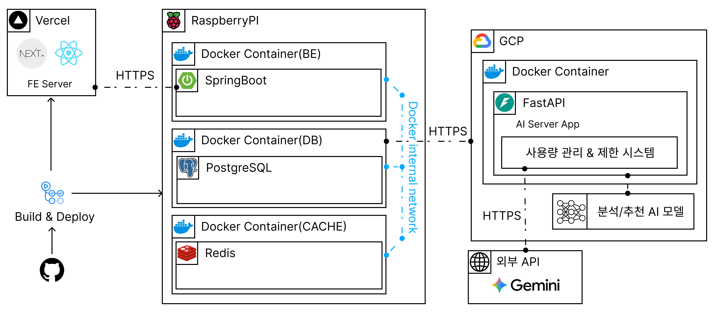
</p>

| 레이어 | 구성 | 역할 |
| :--- | :--- | :--- |
| **FE Server** | Next.js · React (Vercel) | 모바일 우선 UI, 캘린더·리포트 화면 |
| **BE** | Spring Boot (Docker, Raspberry Pi) | REST API, JWT 인증, 데이터 모델 |
| **DB / Cache** | PostgreSQL · Redis (Docker) | 영구 저장 · 캐시 |
| **AI Server** | FastAPI · SQLite (Docker, GCP) | 13차원 점수화, 드릴 추천, 사용량 관리·제한 |
| **External** | Google Gemini | 점수 산출용 LLM (temperature 0.1 · JSON) |
| **CI/CD** | GitHub Actions → Build & Deploy | FE는 Vercel, BE/AI는 Docker 배포 |

> **데이터 모델** — 사용자의 "하루"가 5개 테이블로 분해 저장됩니다: `users` · `entries` · `reports` · `insights` · `baselines`

<br/>

## 🛠 기술 스택 (Tech Stack)

### 💻 Frontend

| Category | Stack |
| :--- | :--- |
| **Language** |  |
| **Framework** |   |
| **Styling** |   |
| **State / Server State** |  |
| **HTTP** |  |
| **Chart** |  |
| **UI / Icons** |   |
| **Deploy** |  |


<br/>

### 🗄 Backend

| Category | Stack |
| :--- | :--- |
| **Language** |  |
| **Framework** |  |
| **Database** |  |
| **Cache** |  |
| **Auth** |  |
| **Build** |  |
| **Container** |  |
| **CI/CD** |  |
| **Deploy** |  |
| **Web Server** |  |

<br/>

### 🤖 AI / ML

| Category | Stack |
| :--- | :--- |
| **Language** |  |
| **API / Server** |   |
| **Data / Validation** |   |
| **LLM** |  |
| **HTTP / Env** |   |
| **Storage** |  |
| **Testing** |    |
| **Lint / Format / Type** |    |
| **Deploy** |  |

<br/>

## 🔥 기술적 도전 (Technical Challenges)

### 1. 진단을 모방하지 않으면서 신뢰를 주기

진단명 대신 **인지 6 · 행동 2 · 감정 5 신호**로 분류하고, "우울증"·"치료" 같은 단어를 코드(`lint_copy.py`)가 CI에서 차단했습니다. *"발견"·"패턴"·"보였어요"* 톤만 배포되도록 강제했습니다.

### 2. 같은 입력에 같은 응답 (Deterministic AI)

LLM의 비결정성을 `temperature 0.1 + JSON 모드`로 제어해, 동일 입력에 동일 점수가 나오도록 했습니다. 출력은 검증 가능한 **점수표** 형태로만 사용자에게 전달됩니다.

### 3. evidence_span — 판단 근거의 추적성

"방금 글에서 '망할 것 같아'가 보이네요"처럼, 모델의 판단 근거를 **사용자의 글 안에서 직접 인용**해 보여줍니다. 신뢰는 증명이 아니라 *"내 글에서 단서를 봤다"* 는 경험에서 나옵니다.

### 4. 위기 데이터 4중 방어

위기 신호 사전 차단 · PII 자동 마스킹 · 평문 로그 0% · 진단 표현 차단을 계층적으로 적용해, 민감 데이터가 외부 LLM으로 평문 전송되지 않도록 보장했습니다.

### 5. 화이트박스 추천 (5단계 결정 트리)

분류기 학습 대신 **LLM 점수 + 보정 + 가중합 ranking**의 명시적 규칙 트리를 설계해, 모든 추천을 "왜"로 역추적할 수 있게 했습니다. (페르소나 8명 시뮬레이션 + 단위 테스트 218개 통과)

### 6. 누적 분석과 자동 발견

매 세션 독립적인 LLM과 달리, 주간 7일 · 월간 30일 통계를 누적해 *"지난주 미래예측 60% → 이번주 42%"* 같은 변화를 자동으로 발견합니다.

<br/>


## 📁 프로젝트 구조 (Project Structure)

```
step-back/
├── frontend/        # Next.js · React (Vercel 배포)
│   ├── app/         # 라우팅 · 페이지
│   ├── components/  # 캘린더 · 리포트 · 드릴 UI
│   ├── hooks/       # 커스텀 훅
│   └── lib/         # API 클라이언트 · 유틸
├── backend/         # Spring Boot (Raspberry Pi · Docker)
│   ├── domain/      # users · entries · reports · insights · baselines
│   ├── api/         # REST 컨트롤러
│   └── auth/        # 인증 · 보안
└── ai/              # FastAPI (GCP · Docker)
    ├── scoring/     # 13차원 점수화 · 환각 가드
    ├── recommend/   # 5단계 드릴 결정 트리
    ├── safety/      # 위기 차단 · PII 마스킹 · lint_copy
    └── reports/     # 주간 · 월간 통계 · 자동 발견
```

> 위 구조는 아키텍처 기준의 **개념적 예시**입니다. 실제 디렉토리에 맞게 정리해 주세요.

<br/>

## 👥 팀 소개 (Team)

> **GDG · Team 1** — 한 줄 입력으로 자기를 발견하는 도구를 만들었습니다.

<table>
  <tr align="center">
    <td><a href="https://github.com/ksjerev17"></a></td>
    <td><a href="https://github.com/nyoeng"></a></td>
    <td><a href="https://github.com/Moderator11"></a></td>
    <td><a href="https://github.com/Grow22"></a></td>
    <td><a href="https://github.com/namgyumin"></a></td>
  </tr>
  <tr align="center">
    <td><a href="https://github.com/ksjerev17"><strong>강민우</strong></a></td>
    <td><a href="https://github.com/nyoeng"><strong>한나영</strong></a></td>
    <td><a href="https://github.com/Moderator1"><strong>박수민</strong></a></td>
    <td><a href="https://github.com/1Grow22"><strong>장성준</strong></a></td>
    <td><a href="https://github.com/namgyumin"><strong>남규민</strong></a></td>
  </tr>
  <tr align="center">
    <td>Product · ML</td>
    <td>Design & Frontend</td>
    <td>Frontend</td>
    <td>Backend</td>
    <td>Backend</td>
  </tr>
  <tr valign="top">
    <td>문제 정의 · 페르소나 · LLM 라벨링/추천 · 학습 알고리즘 · 기능 구현</td>
    <td>사용자 흐름 설계 · 정서적 톤 디자인 · 홈/리포트 화면</td>
    <td>React · Mobile-first · 캘린더/리포트 화면 · 컴포넌트 라이브러리</td>
    <td>Spring Boot · JPA · ERD 설계 · API · 인증 · 데이터 모델</td>
    <td>PostgreSQL · 인덱싱 · ML 서비스 연동 · 운영 환경 · 배포</td>
  </tr>
</table>


<br/>

## ⚠️ 면책 조항 (Disclaimer)

Step Back은 **의료 진단·치료 도구가 아니며**, 정신질환을 진단하거나 전문적 상담·치료를 대체하지 않습니다. 자기 이해를 돕는 **발견 도구**로 설계되었습니다.

지금 많이 힘드시다면, 혼자 견디지 마세요.

- **자살예방상담** ☎ **1393**
- **청소년상담** ☎ **1388**
- **정신건강위기상담** ☎ **1577-0199**

<br/>

<p align="center">
  <sub>Step Back · 나를 위한 하루 한 발짝 🌿</sub>
</p>
